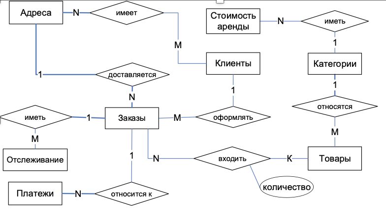
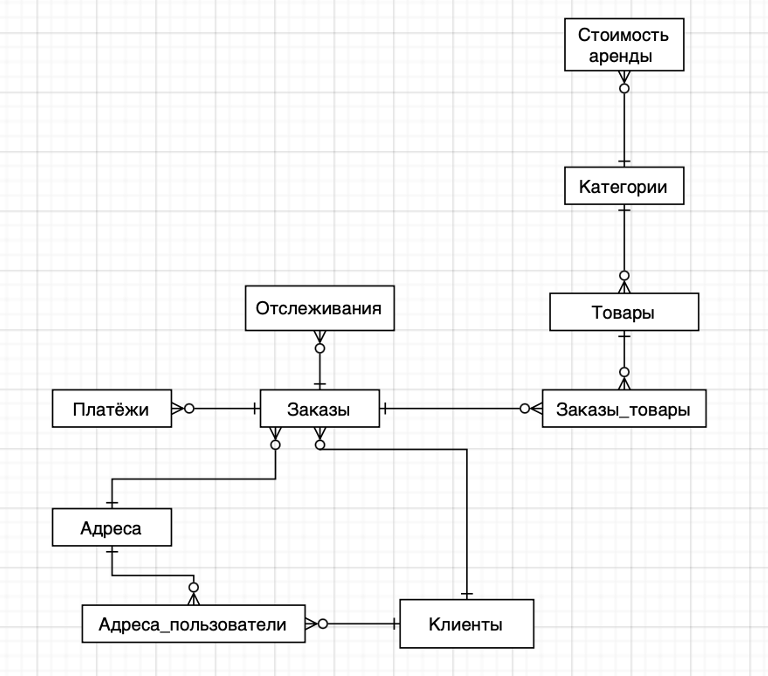

# FUrent

Этот проект представляет собой базу данных для сервиса аренды мебели. База данных реализована на основе объектно-реляционной СУБД PostgreSQL и поддерживает управление пользователями, товарами, заказами, платежами и арендой мебели.

## Оглавление
1. [Описание проекта](#описание-проекта)
2. [Структура базы данных](#структура-базы-данных)
3. [Основные сущности и атрибуты](#основные-сущности-и-атрибуты)
4. [Права доступа и роли пользователей](#права-доступа-и-роли-пользователей)
5. [SQL Скрипты](#sql-скрипты)
6. [Резервное копирование](#резервное-копирование)

## Описание проекта

База данных предназначена для управления процессом аренды мебели. Она хранит информацию о пользователях, товарах, заказах, платежах и условиях аренды. Пользователи могут искать и арендовать мебель, управлять своими заказами и отслеживать статус их выполнения.

## Структура базы данных

База данных включает следующие основные таблицы:
- `Users` - информация о пользователях
- `Products` - информация о товарах
- `Orders` - информация о заказах
- `Payment` - информация о платежах
- `Rent_cost` - стоимость аренды

Дополнительные таблицы:
- `Categories` - категории товаров
- `Tracking` - отслеживание статуса заказа
- `Address` - адреса пользователей

## Основные сущности и атрибуты

- **Клиенты (Users)**
  - `id`: Идентификатор пользователя (PRIMARY KEY)
  - `surname`, `name`, `patronimic`: ФИО
  - `phone`, `email`: Контактные данные
  - `password`: Пароль

- **Товары (Products)**
  - `id`: Идентификатор товара (PRIMARY KEY)
  - `name`: Название товара
  - `price`: Цена
  - `category_id`: Категория товара (FOREIGN KEY)

- **Заказы (Orders)**
  - `order_id`: Идентификатор заказа (PRIMARY KEY)
  - `user_id`: Идентификатор пользователя (FOREIGN KEY)
  - `address_id`: Адрес доставки (FOREIGN KEY)
  - `cost`: Стоимость заказа

## Права доступа и роли пользователей

Пользователи разделены на следующие группы:
- **Пользователи**: имеют доступ к своим данным и заказам.
- **Менеджеры по клиентскому обслуживанию**: управляют заказами и пользователями.
- **Менеджеры по продукту**: управляют товарами и категориями.
- **Бухгалтеры**: управляют платежами и финансовой отчетностью.

Распределение прав доступа настроено с помощью SQL команд `GRANT` для каждой группы пользователей.

## SQL Скрипты

Для создания и настройки базы данных выполните следующие SQL команды:

# Структура базы данных для сервиса по сдаче мебели в аренду

## ER Диаграмма
ER-диаграмма показывает основные сущности и их связи в системе. Система состоит из следующих сущностей: **Клиенты**, **Адреса**, **Заказы**, **Товары**, **Категории**, **Отслеживание**, **Стоимость аренды**, **Платежи** и других.

 

## Схема базы данных

 

### Таблицы и их атрибуты

1. **Клиенты (Users)**
   - `id` (int, PK) - Идентификатор клиента.
   - `surname` (varchar) - Фамилия.
   - `name` (varchar) - Имя.
   - `patronymic` (varchar, NULL) - Отчество.
   - `phone` (varchar) - Номер телефона.
   - `email` (varchar, unique) - Электронная почта.
   - `password` (varchar) - Пароль.

2. **Адреса (Addresses)**
   - `id` (int, PK) - Идентификатор адреса.
   - `house_id` (int, FK) - Идентификатор дома.
   - `flat` (varchar) - Номер квартиры.
   - `user_id` (int, FK) - Идентификатор пользователя.

3. **Заказы (Orders)**
   - `order_id` (int, PK) - Идентификатор заказа.
   - `rental_days` (int) - Количество дней аренды.
   - `start_date` (date) - Дата начала аренды.
   - `cost` (int) - Стоимость аренды.
   - `user_id` (int, FK) - Идентификатор пользователя.
   - `address_id` (int, FK) - Идентификатор адреса.

4. **Товары (Products)**
   - `id` (int, PK) - Идентификатор товара.
   - `name` (varchar) - Название товара.
   - `price` (int) - Цена товара.
   - `description` (varchar, NULL) - Описание товара.
   - `colour_id` (int, FK, NULL) - Идентификатор цвета.
   - `weight` (int, NULL) - Вес товара.
   - `material_id` (int, FK, NULL) - Идентификатор материала.
   - `made_country_id` (int, FK) - Идентификатор страны производителя.
   - `category_id` (int, FK) - Идентификатор категории.

5. **Категории (Categories)**
   - `id` (int, PK) - Идентификатор категории.
   - `name` (varchar) - Название категории.

6. **Отслеживание (Tracking)**
   - `id` (int, PK) - Идентификатор отслеживания.
   - `order_id` (int, FK) - Идентификатор заказа.
   - `status_id` (int, FK) - Идентификатор статуса доставки.

7. **Стоимость аренды (Rent Cost)**
   - `id` (int, PK) - Идентификатор стоимости аренды.
   - `product_id` (int, FK) - Идентификатор товара.
   - `min_rent` (int) - Минимальный срок аренды.
   - `max_rent` (int) - Максимальный срок аренды.
   - `price` (int) - Цена за один день аренды.

8. **Платежи (Payments)**
   - `id` (int, PK) - Идентификатор платежа.
   - `payment_date` (date) - Дата и время платежа.
   - `payment_method_id` (int, FK) - Идентификатор способа оплаты.
   - `payment_status_id` (int, FK) - Идентификатор статуса оплаты.
   - `order_id` (int, FK) - Идентификатор заказа.

### Дополнительные таблицы

- **Цвета (Colours)**: Содержит возможные цвета товаров.
- **Материалы (Materials)**: Содержит возможные материалы товаров.
- **Статусы оплаты (Payment Status)**: Содержит возможные статусы оплаты.
- **Способы оплаты (Payment Methods)**: Содержит возможные способы оплаты.
- **Статус доставки (Tracking Status)**: Содержит возможные статусы доставки.
- **Страна производитель (Origin Country)**: Содержит список стран-производителей.

